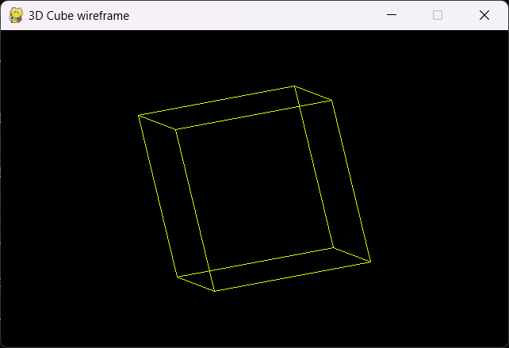
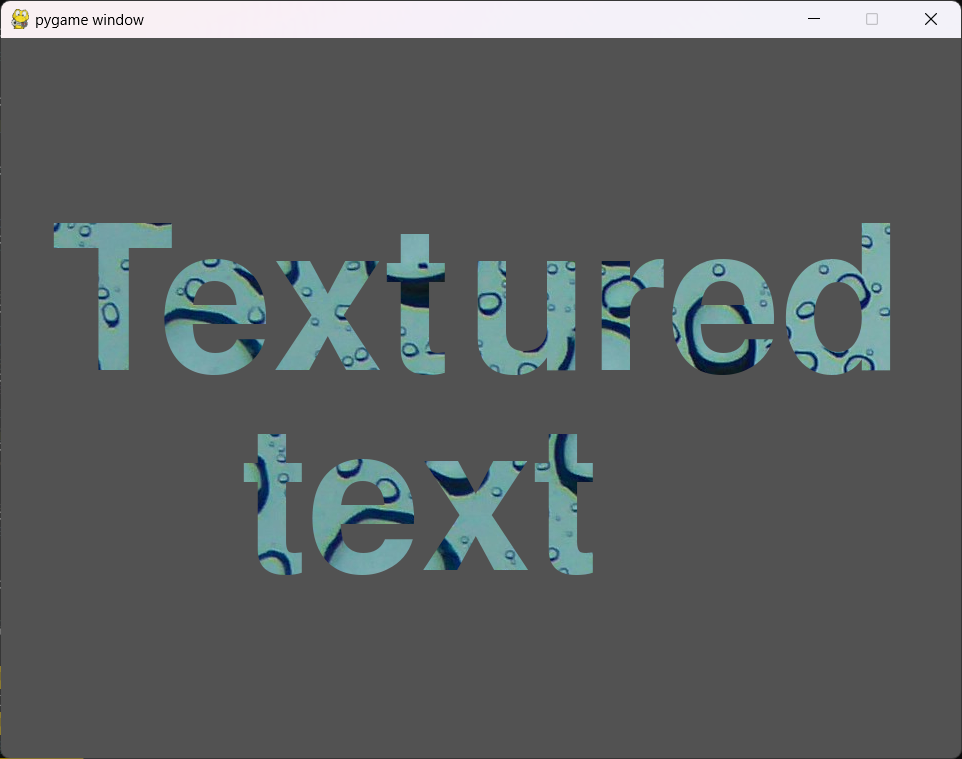
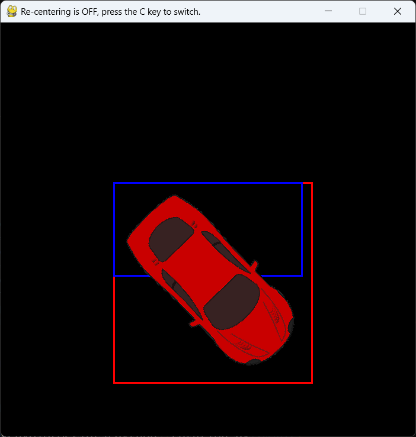
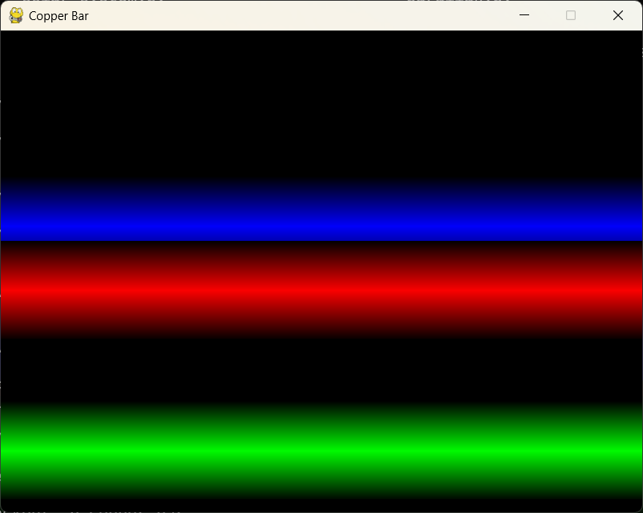

# Various Recipe for pygame-ce

A collection of recipes for [pygame-ce](https://github.com/pygame-community/pygame-ce) (can work with pygame too) collected from various sites or programmed by me.

All recipes have been tested with **pygame-ce 2.5.2** and **python 3.13.1**.

## Overview

### 3D

| 3D-wireframe-cube.py |
|----------|
|  |

### font

| font-outline.py | font-textured.py |
|----------|----------|
|  |  |

### image

| image-color.py | image-rotation.py |
|----------|----------|
|  |  |

| image-tint.py |
|----------|
|  |

### palette

| palette-swap.py |
|----------|
|  |

### particles

| particles-firework.py | particles-firework_bw.py |
|----------|----------|
|  |  |

| particles-firework_colors.py | particles-flame.py |
|----------|----------|
|  |  |

| particles-flames.py | particles-starfield-3D.py |
|----------|----------|
|  |  |

| particles-starfield-vertical.py | particles-starfield-voxel-tunnel.py |
|----------|----------|
|  |  |

| particles-starfield-voxel.py |
|----------|
|  |

### screen

| screen-shake.py |
|----------|
|  |

### sprites

| sprites-unlimited.py |
|----------|
|  |

### text

| text-scroll.py | text-sinus-scrolling.py |
|----------|----------|
|  |  |

### various

| amiga_copper_bar.py | parallax.py |
|----------|----------|
|  |  |

## License

MIT License
