

# pygame-ce-cookbook

# Various Recipe for pygame-ce

A collection of recipes for &nbsp; [pygame-ce](https://github.com/pygame-community/pygame-ce) &nbsp; (can work with pygame too) collected from various sites or programmed by me.

All recipes have been tested with &nbsp; **pygame-ce 2.5.2** &nbsp; and &nbsp; **python 3.13.1**.

## Overview

### font

    font-outline.py
    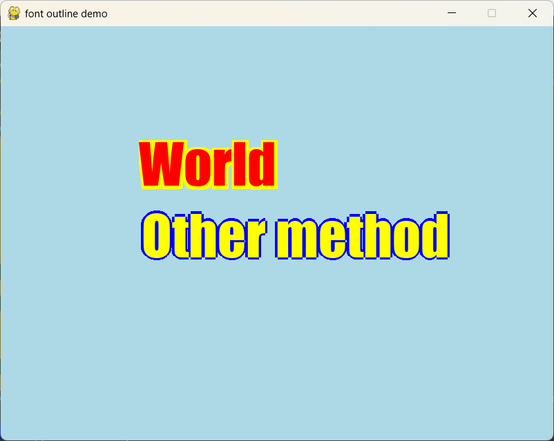

### image

    image-color.py
    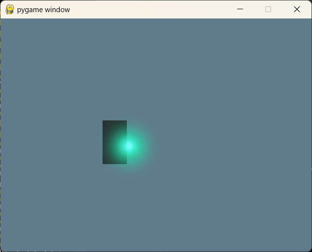

    image-tint.py
    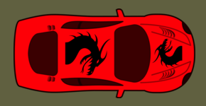

### palette

    palette-swap.py
    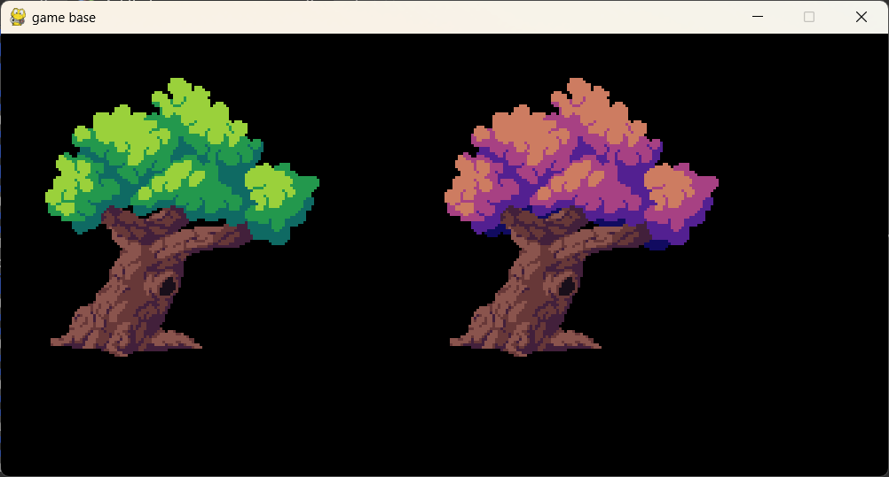

### particles

    particles-firework.py
    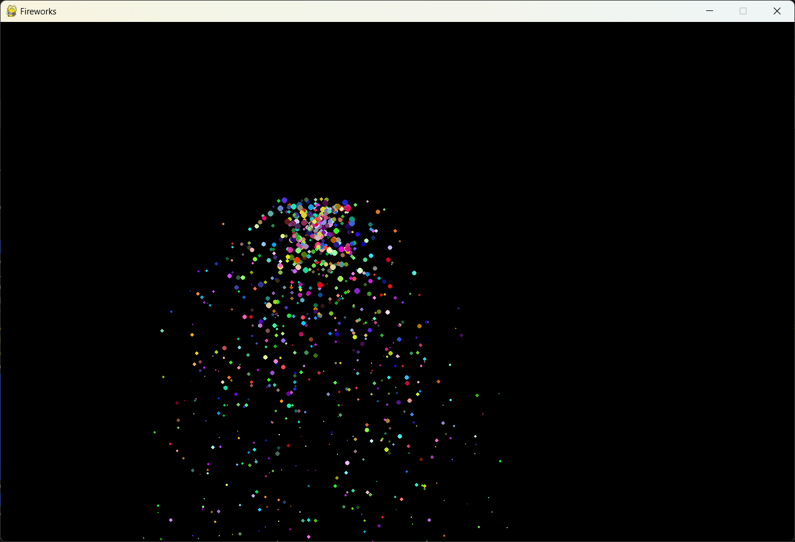

    particles-firework_bw.py
    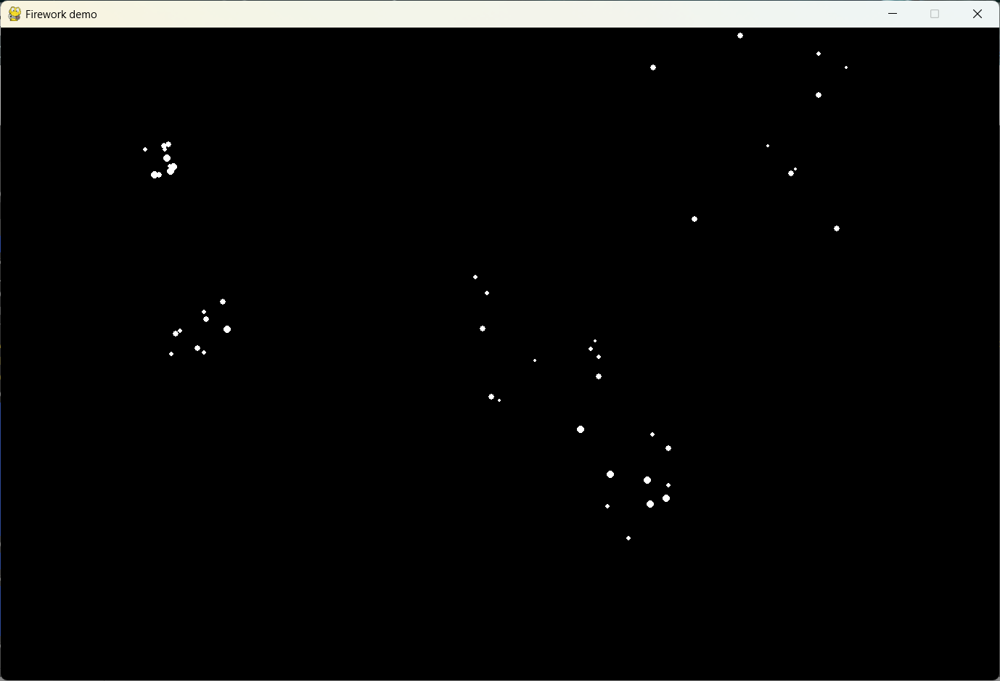

    particles-firework_colors.py
    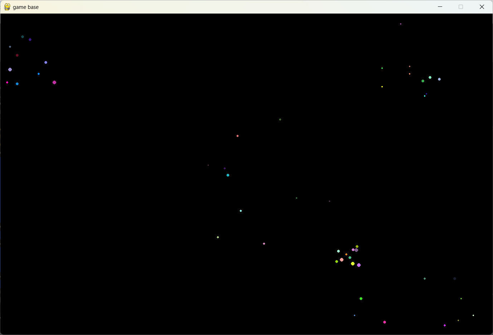

    particles-flame.py
    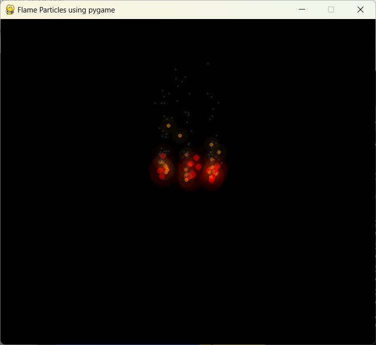

    particles-flames.py
    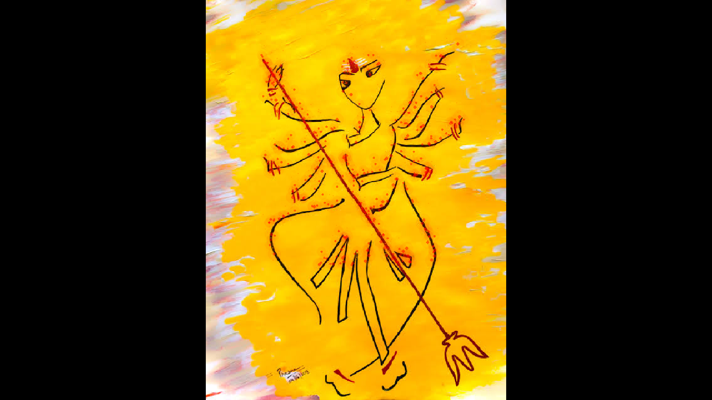

    particles-starfield-3D.py
    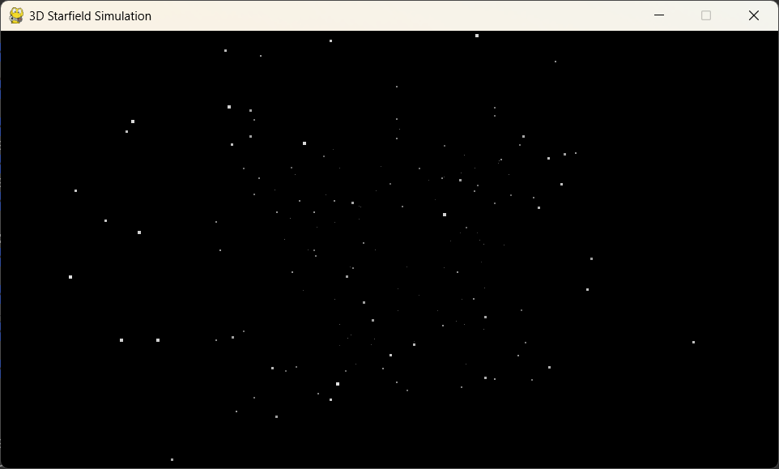

    particles-starfield-vertical.py
    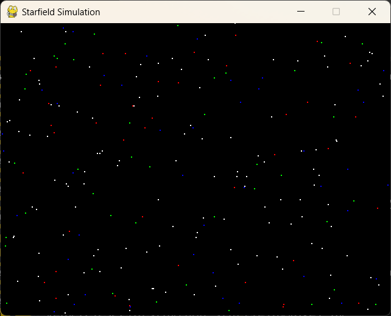

    particles-starfield-voxel-tunnel.py
    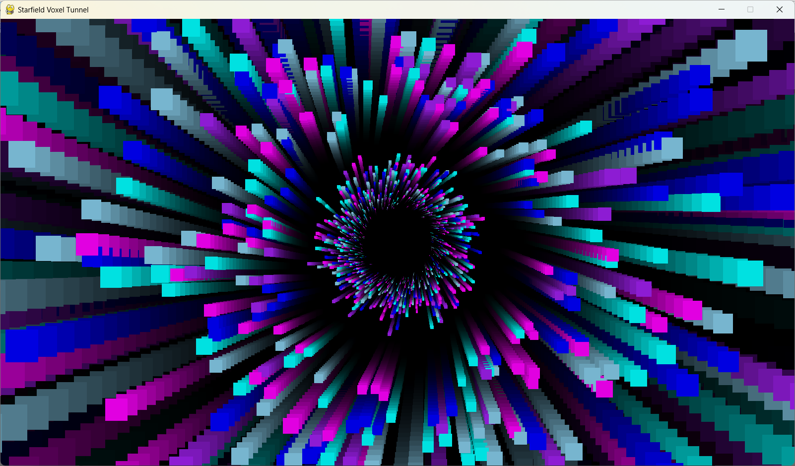

    particles-starfield-voxel.py
    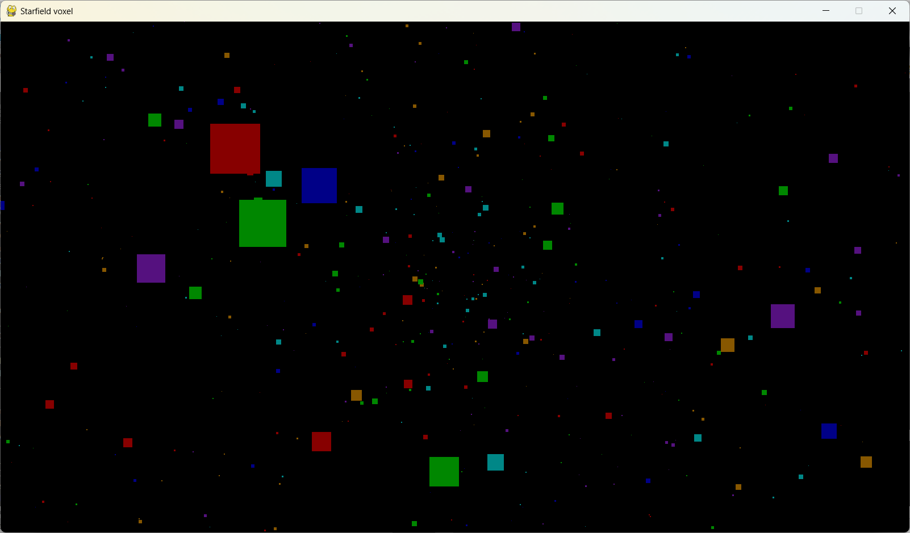

### screen

    screen-shake.py
    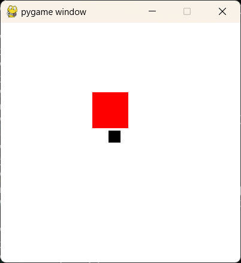

### sprites

    sprites-unlimited.py
    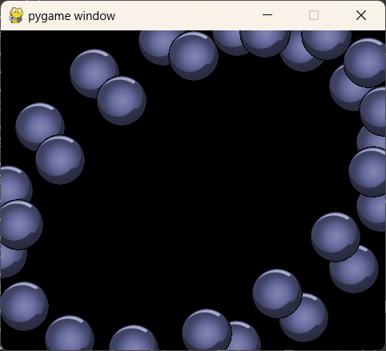

### text

    text-scroll.py
    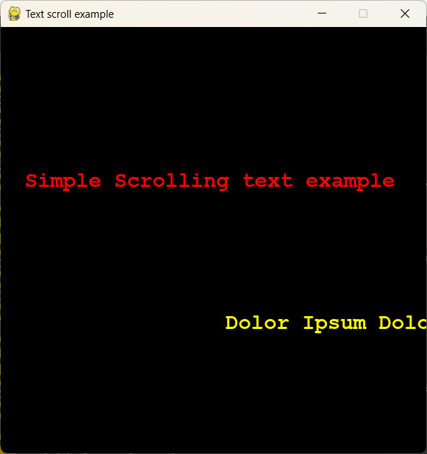

    text-sinus-scrolling.py
    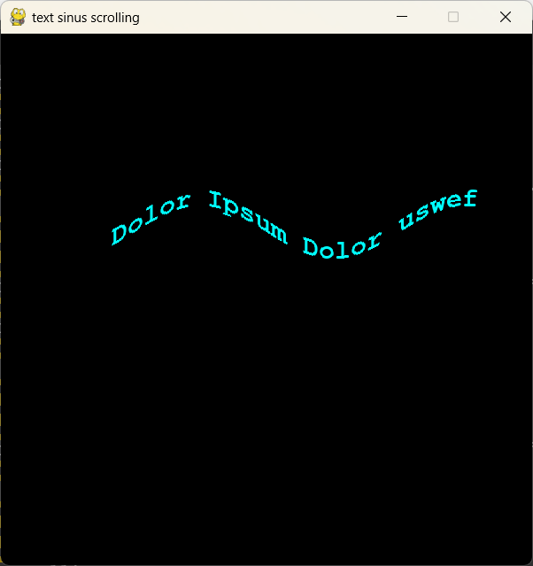

### various

    parallax.py
    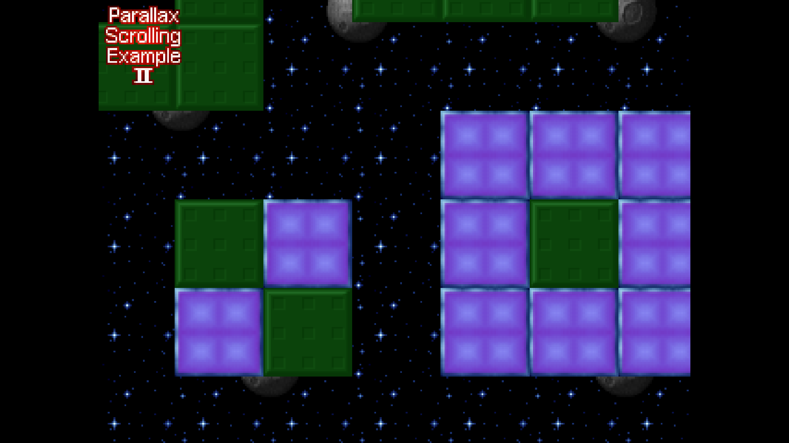

## License

MIT License
